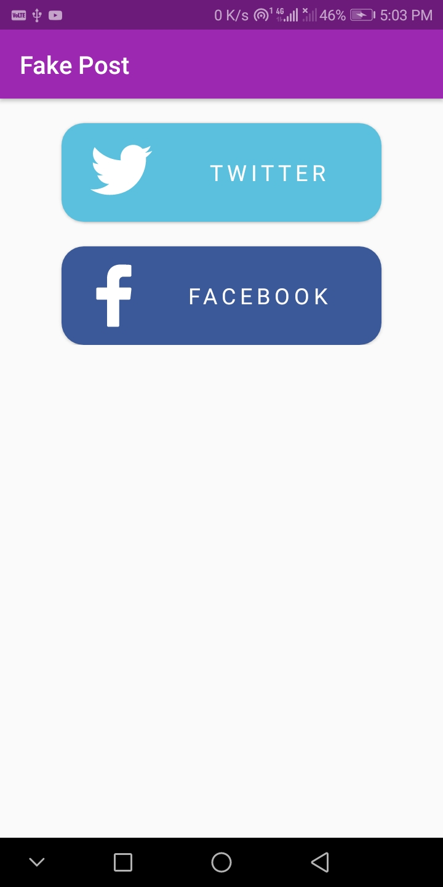
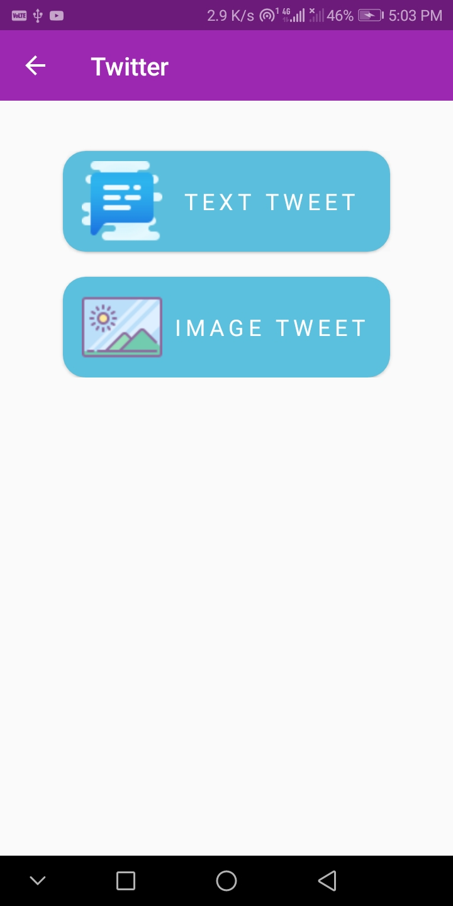
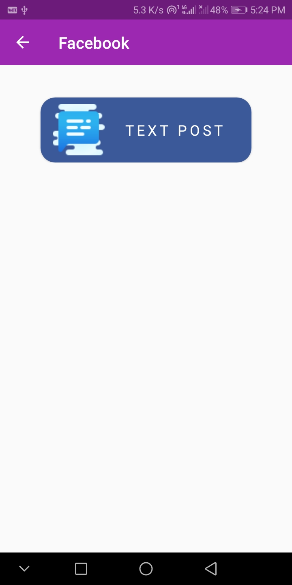
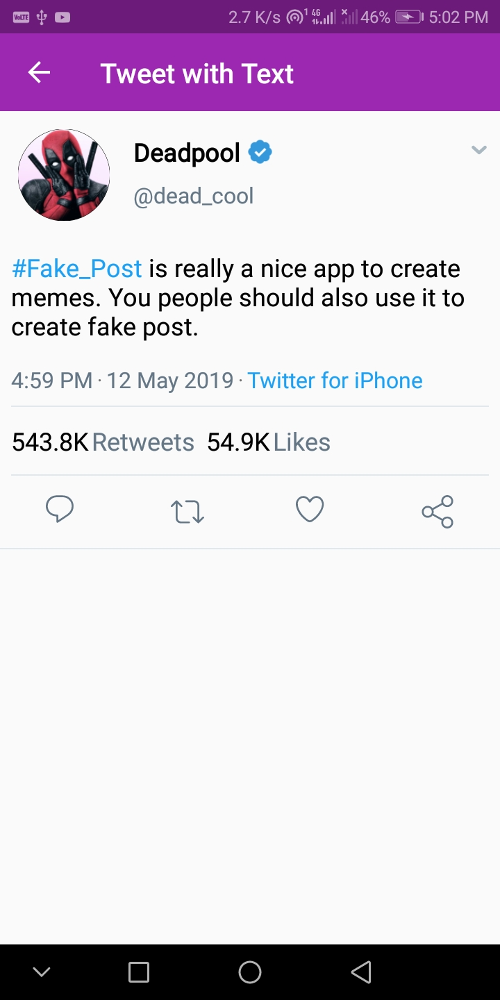
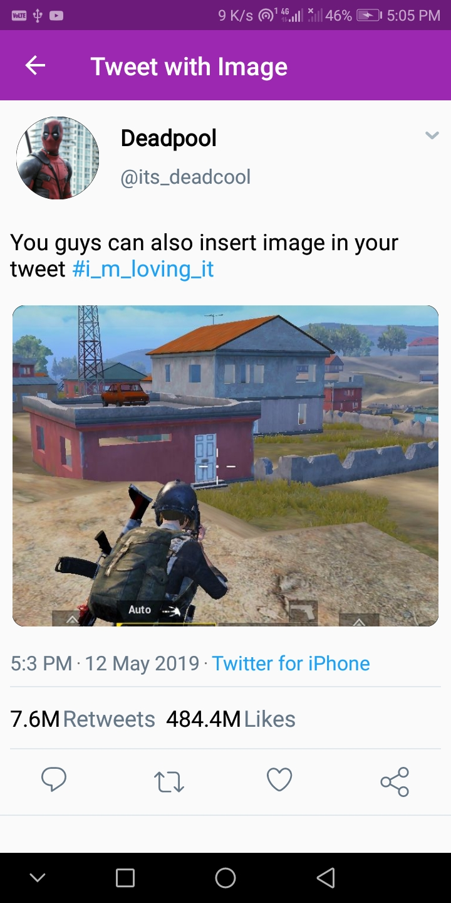
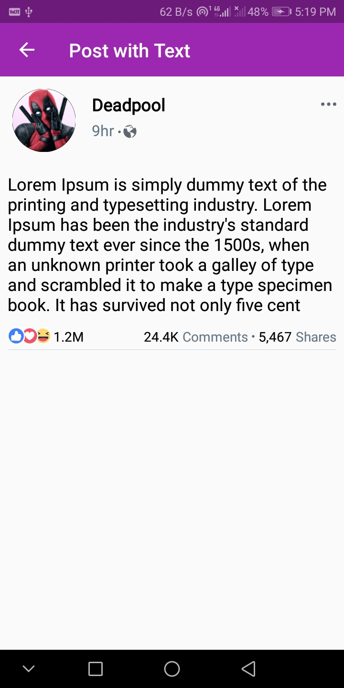

# Fake_Post
Android App to create fake post of twitter and facebook.
This app can be easily use to create meme using posts.

### Wanna try ? [Get apk](https://drive.google.com/file/d/1We5JHhigui-Ny_ONTGizHMcE_Swev5Bq/view)

## Screenshots

| Home Page     | Twitter Options  | Facbook Option  | 
|---------------|------------------|-----------------|
||||

| Twitter Text Post | Twitter Image Post | Facebook Text Post | 
|-------------------|--------------------|--------------------|
||||

## Options

1. Twitter Text Post
2. Twitter Image Post
3. Facebook Post

## Features

### Twitter
1. Camera and Gallery option to select Profile Pic
2. Option to enable Verified Icon on twitter post
3. Modify numbers of Retweets and Likes
4. Change Date & Time according to your prefrences
5. Options to select device (iPhone or Android)

### Facebook
1. Camera and Gallery option to select Profile Pic
2. Modify values of reactions according to your post
3. Modify numbers of Comments and Shares
4. Change Date & Time according to your prefrences
5. Options to select Post privacy (public or friends)

